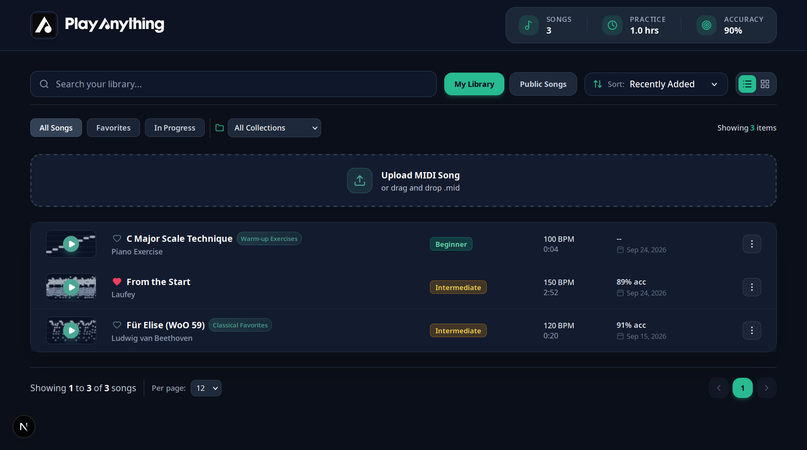
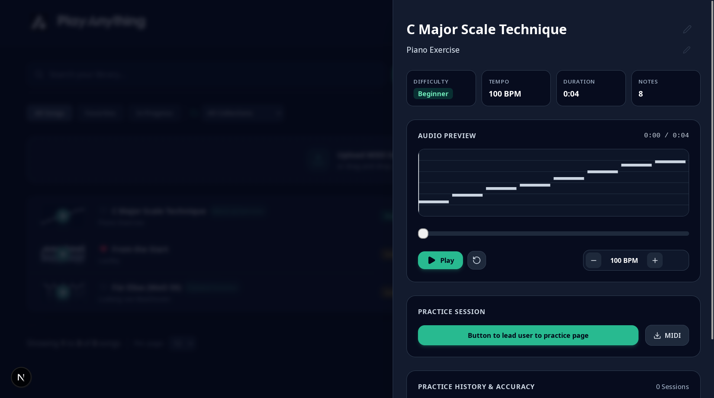
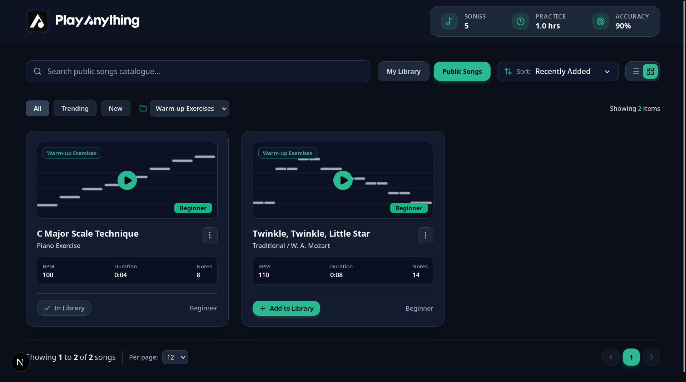

# Songscription Fullstack Take-Home

## Screenshots of UI

## Some notes about building it:

 - Coding was done by cycling through three free antigravity accounts and the Claude webapp. Total time: ~2.5 hrs

 - I chose Supabase for the backend because I had worked with it before, its main benefit is that it's free and scalable. Previously I'd used Pocketbase, but it isn't as powerful as Supabase.

 - One thing I would've done different with more time (really, more credits) is structuring the database better. Notably, .mid songs would definitely go in a storage bucket rather than be saved directly in a table. 

 - I'm most proud of the UX when searching for songs! I looked to Musescore for inspiration, and so theres both the option to search for user-uploaded songs but also public songs, allowing users to get recommendations for new songs to try playing.

